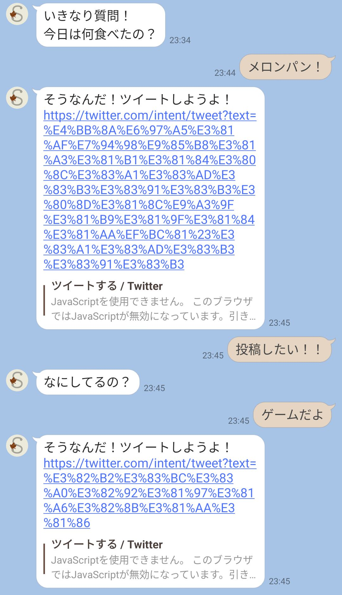

# moremoresns
# OverView　"moremoresns"

"moremoresns"はSNSの投稿をサポートするアプリです。
投稿したいけど何を投稿したらいいかわからない問題を解決します。

<!-- [Go to app](https://xxx) -->
<!-- から使用することができます。 -->
# DEMO
<!--  -->


# Features
AIと会話することで自動で投稿が生成され、すぐに投稿できます。
「投稿」とメッセージを送って届く質問か、定期的届く質問に答えることで投稿は生成されます。

投稿は、テキストマイニングやgpt3を用いて生成されます。

# Installation :balloon:
## 環境
環境設定には`docker`を使用します。`git`によって環境をコピーし、`docker`によって起動できます。
```bash
git clone git@github.com:na0ki-y/docker_first.git
cd docker-python/
docker compose up -d --build
```
## 接続
接続は以下で行います。または、VScodeで接続できます。

```bash
docker compose exec サービス名 bash
docker exec -it コンテナ名 /bin/bash
```
## シークレット
シークレットファイルがあります。
```bash
cd /opt/server/
mkdir secrets
cd secrets
touch secrets.json
touch OPENAI_KEY
```
中身の形式は以下です。\
- secrets.json
```secrets.json
{
    "Line":{
        "Channel_id":"1111",
        "Channel_access_token":"xxxxx",
        "Channel_secret": "xxxxxx"
    }
}
```
- OPENAI_KEY
```OPENAI_KEY
XXXXXX
```
## 起動
### サーバ
docker環境内で以下のコマンドを実行するとサーバーが起動します。
```bash
cd /root/opt/server
pipenv shell
uvicorn run:app --reload
```
### ブロードキャストボタン
全員にメッセージ（質問）をstreamlitのボタンで送ることができます。
```bash
cd /root/opt/streamlit
pipenv shell
streamlit run maintain.py
```
### スケジューラ
全員にメッセージ（質問）を定期的に自動で送ることができます。
```bash
cd /root/opt/streamlit
pipenv shell
python reminder.py
```

# Author
[OPEN Hack U 2022 Spring ONLINE](https://hacku.yahoo.co.jp/hacku2022spring_online/index.html) 13-まてりある
